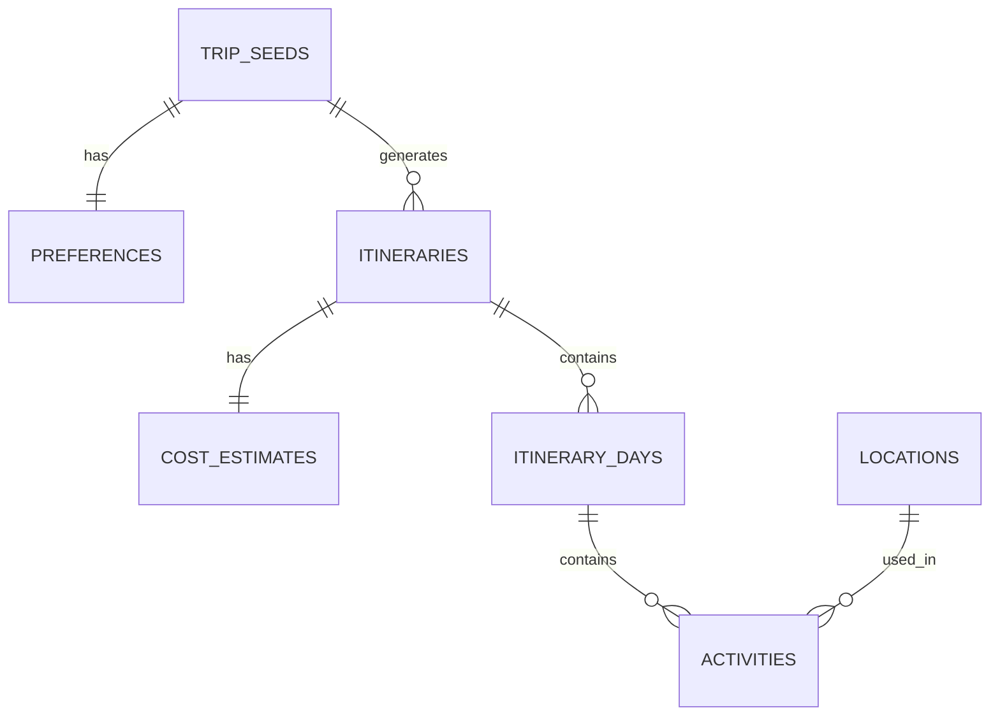

# Entity-Relationship Diagram Notes
## Link2Itinerary

**Purpose:** This document contains notes and planning for the ERD visual diagram.

---

## Planned Diagram Tool

**Options:**
1. **draw.io** (free, web-based, easy collaboration)
2. **dbdiagram.io** (specialized for database schemas)
3. **Mermaid** (text-based, can be embedded in markdown)
4. **Lucidchart** (professional, may require account)

**Recommended:** draw.io or dbdiagram.io

---

## Text-Based ERD (Placeholder)

Below is a text representation of the ERD until a visual diagram is created:

```
┌──────────────────────┐           ┌──────────────────────┐
│     trip_seeds       │◄──────────┤    preferences       │
├──────────────────────┤    1:1    ├──────────────────────┤
│ PK: id (UUID)        │           │ PK: id (UUID)        │
│     url              │           │ FK: trip_seed_id     │
│     summary          │           │     interests[]      │
│     location         │           │     budget_tier      │
│     check_in         │           │     travel_pace      │
│     check_out        │           │     dietary[]        │
│     accommodation    │           │     accessibility[]  │
│     status           │           └──────────────────────┘
└──────────┬───────────┘
           │
           │ 1:N
           ▼
┌──────────────────────┐           ┌──────────────────────┐
│    itineraries       │◄──────────┤   cost_estimates     │
├──────────────────────┤    1:1    ├──────────────────────┤
│ PK: id (UUID)        │           │ PK: id (UUID)        │
│ FK: trip_seed_id     │           │ FK: itinerary_id     │
│     type             │           │     total_min/max    │
│     status           │           │     dining_min/max   │
│     total_activities │           │     activities_      │
│     estimated_cost   │           │     transport_       │
│     generated_at     │           │     shopping_        │
└──────────┬───────────┘           │     misc_            │
           │                       └──────────────────────┘
           │ 1:N
           ▼
┌──────────────────────┐
│   itinerary_days     │
├──────────────────────┤
│ PK: id (UUID)        │
│ FK: itinerary_id     │
│     date             │
│     day_number       │
│     theme            │
│     highlights[]     │
│     daily_cost       │
└──────────┬───────────┘
           │
           │ 1:N
           ▼
┌──────────────────────┐
│     activities       │
├──────────────────────┤
│ PK: id (UUID)        │
│ FK: itinerary_day_id │
│ FK: location_id      │◄───────┐
│     sequence_order   │        │
│     time             │        │ N:1
│     duration         │        │
│     title            │        │
│     description      │        │
│     category         │        │
│     estimated_cost   │        │
│     booking_url      │        │
│     tips[]           │        │
└──────────────────────┘        │
                                │
                     ┌──────────┴───────────┐
                     │     locations        │
                     ├──────────────────────┤
                     │ PK: id (UUID)        │
                     │     name             │
                     │     address          │
                     │     city             │
                     │     country          │
                     │     latitude         │
                     │     longitude        │
                     │     place_type       │
                     │     metadata         │
                     └──────────────────────┘
```

---

## Cardinality Summary

| Relationship | Cardinality | Description |
|--------------|-------------|-------------|
| trip_seeds → preferences | 1:1 | Each trip seed has one preference set |
| trip_seeds → itineraries | 1:N | One trip seed can have one itinerary |
| itineraries → cost_estimates | 1:1 | Each itinerary has one cost breakdown |
| itineraries → itinerary_days | 1:N | Each itinerary has multiple days |
| itinerary_days → activities | 1:N | Each day has multiple activities |
| locations → activities | 1:N | One location can be used by many activities |

---

## Entity Colors (for Visual Diagram)

When creating the visual ERD, use these color suggestions:

- **Core entities** (trip_seeds, itineraries): Blue
- **Supporting entities** (preferences, itinerary_days, activities): Green
- **Lookup/Reference entities** (locations): Yellow
- **Secondary features** (cost_estimates): Orange

---

## Steps to Create Visual ERD

### Using draw.io

1. Go to https://app.diagrams.net/
2. Create new diagram → "Entity Relationship Diagram" template
3. Add entities as rectangles with:
   - Entity name at top (bold)
   - Attributes listed below
   - Primary keys underlined
   - Foreign keys marked with "FK:"
4. Connect entities with lines:
   - 1:N relationships: crow's foot notation
   - 1:1 relationships: straight line with "1" on both ends
5. Export as PNG or SVG
6. Save in `db/` folder as `erd-diagram.png`

### Using dbdiagram.io

1. Go to https://dbdiagram.io/
2. Use their DBML syntax to define tables:
   ```dbml
   Table trip_seeds {
     id uuid [pk]
     url text [not null]
     location varchar(255)
     // ... other fields
   }

   Ref: trip_seeds.id < itineraries.trip_seed_id
   ```
3. Diagram auto-generates
4. Export as PNG or PDF
5. Save in `db/` folder

### Using Mermaid (in Markdown)

Add to this file or schema-plan.md:



---

## Action Items

- [ ] Choose ERD tool (draw.io recommended)
- [ ] Create visual diagram
- [ ] Export as image (PNG or SVG)
- [ ] Add to this folder: `db/erd-diagram.png`
- [ ] Update schema-plan.md with link to diagram

---

## Notes for Visual Diagram

**Key Elements to Include:**
- All table names (entities)
- Primary keys (PK) clearly marked
- Foreign keys (FK) clearly marked
- Cardinality (1:1, 1:N) on relationship lines
- Use crow's foot notation for clarity

**Optional Enhancements:**
- Color-code entities by category
- Add field data types (UUID, VARCHAR, etc.)
- Mark indexes with special symbol

---

## Example Reference

For inspiration, see examples at:
- https://dbdiagram.io/d (public gallery)
- https://drawio-app.com/database-diagram-examples/

---

*This is a planning document. Once the visual ERD is created, link it here.*
